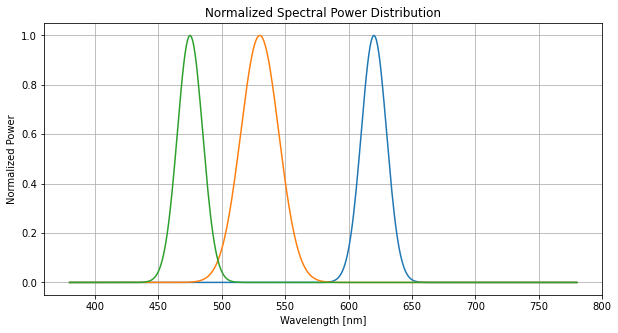

========
Overview
========

.. start-badges

.. list-table::
    :stub-columns: 1

    * - docs
      - |docs|
    * - tests
      - |
        |
    * - package
      - | |version| |wheel| |supported-versions| |supported-implementations|
        | |commits-since|
.. |docs| image:: https://readthedocs.org/projects/python-vlc-rm/badge/?style=flat
    :target: https://python-vlc-rm.readthedocs.io/
    :alt: Documentation Status

.. |version| image:: https://img.shields.io/pypi/v/vlc-rm.svg
    :alt: PyPI Package latest release
    :target: https://pypi.org/project/vlc-rm

.. |wheel| image:: https://img.shields.io/pypi/wheel/vlc-rm.svg
    :alt: PyPI Wheel
    :target: https://pypi.org/project/vlc-rm

.. |supported-versions| image:: https://img.shields.io/pypi/pyversions/vlc-rm.svg
    :alt: Supported versions
    :target: https://pypi.org/project/vlc-rm

.. |supported-implementations| image:: https://img.shields.io/pypi/implementation/vlc-rm.svg
    :alt: Supported implementations
    :target: https://pypi.org/project/vlc-rm

.. |commits-since| image:: https://img.shields.io/github/commits-since/jufgutierrezgo/python-vlc-rm/v0.0.0.svg
    :alt: Commits since latest release
    :target: https://github.com/jufgutierrezgo/python-vlc-rm/compare/v0.0.0...main

.. end-badges

What is VLC-RM ?
================

VLC-RM is a package designed to simulate Visible Light Communication (VLC) systems based on Color Shift Keying 
modulation within indoor environments. The package calculates the propagation of light for multiple wavelengths 
in a rectangular empty room. Building upon a modified version of the Recursive Model (RM) presented in [1], 
this package provides the DC gain at each central wavelength. In order to compute this propagation, VLC-RM 
takes into account the spectral power distribution of multiple LEDs, the spectral response of the multiple 
color detectors, and the reflectance of the room's walls at central wavelengths. The spectral power distribution 
emitted by the LED-based transmitter is assumed to have a Gaussian shape, and the spatial intensity distribution 
is assumed to be a Lambertian radiator. A grid of points is used to discretize the room's walls into smaller square areas.

The package executes a recursive algorithm to obtain the DC gain at each central wavelength and the minimum 
distance of the constellation. Based on the computation of the DC gain, the interchannel interference of the CSK-VLC 
system is estimated, along with the lighting parameters. The recursive algorithm assumes that the room's walls are 
perfect diffuse reflectors and that the transmitter is a point light source. The package simulates the transmission 
of CSK symbols through an Additive White Gaussian Noise (AWGN) channel. The received symbols are computed in the 
photodetected current space using the interchannel interference matrix and adding a gaussian noise.     

* Free software: BSD 3-Clause License

Installation
============

::

    pip install vlc-rm

You can also install the in-development version with::

    pip install https://github.com/jufgutierrezgo/python-vlc-rm/archive/main.zip

An example of a VLC simulation
===============================

This example describes the usage of the VLC-RM package for characterizing a VLC system 
based on IEEE 16-CSK modulation within an empty rectangular space. The modulation 
is defined in [2]. 

Defining the VLC transmitter
----------------------------

The VLC system is composed by three elements: the LED-based transmitter, the photodetector, 
and the indoor environment (empty rectangular room). To defined the LED-based transmitter 
is used the transmitter-module. The module must be imported and creating a transmitter-type object 
as follows:

.. code-block:: python

    # Import Transmitter
    from vlc_rm.transmitter import Transmitter

    # Create a transmitter-type object 
    transmitter = Transmitter(
            "Led1",
            position=[2.5, 2.5, 3],
            normal=[0, 0, -1],
            mlambert=1,
            wavelengths=[620, 530, 475],
            fwhm=[20, 30, 20],
            modulation='ieee16',
            luminous_flux=5000
                    )

'transmitter' object is defined from seven parameters. The position and normal are defined by the 
3D-cartesian coordinates. Three central wavelengths (in nanometers) are fixed as **[620, 530, 475]**, 
which means that the transmitter uses three color LED: red, green, and blue or RGB-LED. The full 
width at half maximum (in nanometers) for each color LED is fixed as **[20, 30, 20]**. The modulation 
parameter defines the type of CSK modulation that can be simulated. Modulation parameter is 'ieee16' 
as default. The luminous_flux (in Lumens) defines the average luminous flux emmited by the transmitter.
After defining the 'transmitter' module, the string representation of the object can be realized as follows:  

.. code-block:: python
    
    # Print the 'transmitter' object
    print(transmitter)
    

which produces an output similar to::

    List of parameters for LED transmitter: 
    Name: Led1
    Position [x y z]: [2.5000e+00 2.5000e+00 3.0000e+00] 
    Normal Vector [x y z]: [[0.0000e+00 0.0000e+00 -1.0000e+00]] 
    Lambert Number: 1.0 
    Central Wavelengths [nm]: [6.2000e+02 5.3000e+02 4.7500e+02] 
    FWHM [nm]: [2.0000e+01 3.0000e+01 2.0000e+01]
    Luminous Flux [lm]: 5000.0
    ILER [W/lm]: 
    [[3.8001e-03 0.0000e+00 0.0000e+00]
    [0.0000e+00 1.8197e-03 0.0000e+00]
    [0.0000e+00 0.0000e+00 1.1960e-02]] 
    Average Power per Channel Color: 
    [6.3336e+00 3.0328e+00 1.9934e+01] 
    Total Power emmited by the Transmitter [W]: 
    29.30032767693627 

The spectral power distribution of the LED-transmitter according to the central wavelengths,
the FWDM, and the luminous flux can be plotted with:

.. code-block:: python
    
    # Plot the normalized spectral power distribution 
    transmitter.plot_spd_normalized()
    
The output image is:

'transmitter' object is defined from seven parameters. The **position** and **normal** parameters are defined by the 
3D-cartesian coordinates. It means that the transmitter will be located in the *[x=2.5, y=2.5, z=3]*.
Through the wavelengths parameter, three central wavelengths (in nanometers) are fixed as *[620, 530, 475]*, 
which means that the transmitter uses three color LED: red, green, and blue or RGB-LED. The **fwhm** parameter set 
full width at half maximum (in nanometers) for each color LED as *[20, 30, 20]*. The **modulation**
parameter defines the type of CSK modulation that can be simulated. **modulation** parameter is 'ieee16' 
as default. The **luminous_flux** (in Lumens) defines the average luminous flux emmited by the transmitter.
After defining the 'transmitter' module, the string representation of the object can be realized as follows:  

Defining the VLC photodetector
------------------------------

To defined the photodetector is used the photodetector-module. The module must be imported 
and creating a photodetector-type object as follows:

.. code-block:: python

    pd = Photodetector(
        "PD1",
        position=[1.5, 1.5, 0.85],
        normal=[0, 0, 1],
        area=(1e-6)/3,
        #area=1e-4,
        fov=85,
        sensor='S10917-35GT',
        idark=1e-12
                )

'photodetector' object is defined from six parameters. The photodetector's position 
is defined in the 3D-cartesian coordinate equal to *[x=1.5, y=1.5, z=0.85]*, and a normal 
vector equal to **[0, 0, 1]**. The area parameter is configured the active area 
(in square meters) at the detector equal to *(1e-6)/3*. The **fov** parameter represents the 
field-of-view of the photodetector in degrees, and it is setted at *85*. The **sensor** parameter 
is defined as the reference of the sensor that are available in the package. According to the sensor's
reference is the spectral response of the photodetector. The **idark** parameter defines the dark current
(in Amperes) of the photodetector. This current is setted as *1e-12*. 
To get the string representation of the object can be realized as follows:   

Documentation
=============

https://python-vlc-rm.readthedocs.io/

Development
===========

To run all the tests run::

    tox

Note, to combine the coverage data from all the tox environments run:

.. list-table::
    :widths: 10 90
    :stub-columns: 1

    - - Windows
      - ::

            set PYTEST_ADDOPTS=--cov-append
            tox

    - - Other
      - ::

            PYTEST_ADDOPTS=--cov-append tox

References
===========

[1] Barry, J. R., Kahn, J. M., Krause, W. J., Lee, E. A., & Messerschmitt, D. G. (1993). 
Simulation of multipath impulse response for indoor wireless optical channels. IEEE journal on selected areas in communications, 11(3), 367-379.

[2] IEEE Standards Association. (2019). IEEE Standard for Local and metropolitan area networks—Part 15.7: 
Short-Range Optical Wireless Communications (IEEE Std 802.15.7-2018, Revision of IEEE Std 802.15.7-2011) (pp. 1-407). 
https://ieeexplore.ieee.org/document/8697198